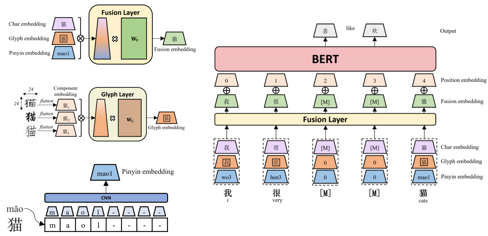

### ChineseBert: Chinese Pretraining Enhanced by Glyph and Pinyin Information

Recent pretraining models in Chinese neglect two important aspects specific 
to the Chinese language: glyph and pinyin, 
which carry significant syntax and semantic information for language understanding. 
In this work, we propose ChineseBERT, 
which incorporates both the glyph(visual) and pinyin(phonetic) information of Chinese characters 
into language model pretraining.   
The glyph embedding is obtained based on different fonts of a Chinese character, 
being able to capture character semantics from the visual features, 
and the pinyin embedding characterizes the pronunciation of Chinese characters, 
which handles the highly prevalent heteronym phenomenon in Chinese 
(the same character has different pronunciations with different meanings).   
Pretrained on large-scale unlabeled Chinese corpus, 
the proposed ChineseBERT model yields a significant performance 
boost over baseline models with fewer training steps. 
The proposed model achieves new SOTA performances on a wide range of Chinese NLP tasks(e.g. MRC, NLI, NER)

More details can be found here: [[paper](https://aclanthology.org/2021.acl-long.161/)], [[code](https://github.com/ShannonAI/ChineseBert)]

---

### Self-explaining structures improve NLP models

In this paper, we propose a simple yet general and effective self-explaining framework 
for deep learning models in NLP. 
The key point of the proposed framework is to put an additional layer, 
as is called the interpretation layer, 
on top of any existing NLP model. 
This layer aggregates the information for each text span, 
which is then associated with a specific weight, 
and their weighted combination is fed to the softmax function for the final prediction. 
The proposed model comes with the following merits:   
(1) span weights make the model self-explainable and do not require an additional 
probing model for interpretation  
(2) the proposed model is general and can be adapted to any existing deep learning structures in NLP  
(3) the weight associated with each text span provides direct importance scores for 
higher-level text units such as phrases and sentences  
We for the first time show that interpretability does not come at the cost of performance: 
a neural model of self-explaining features obtains better performances than its counterpart 
without the self-explaining nature, 
achieving a new SOTA performance of 59.1 on SST-5 and a new SOTA performance of 92.3 on SNLI.

More details can be find here: [[paper](https://arxiv.org/abs/2012.01786)], [[code](https://github.com/ShannonAI/Self_Explaining_Structures_Improve_NLP_Models)]

  

---

### Entity-Relation Extraction as Multi-Turn Question Answering

We proposed a new paradigm for the task of entity-relation extraction. 
We cast the task as a multi-turn question answering problem, i.e., 
the extraction of entities and relations is transformed to the task of 
identifying answer spans from the context. 
This multi-turn QA formalization comes with several key advantages:  
(1) the question query encodes important information for the entity/relation 
class we want to identify  
(2) QA provides a natural way of jointly modeling entity and relation  
(3) it allows us to exploit the well developed machine reading comprehension (MRC) models.   
Experiments on the ACE and the CoNLL04 corpora demonstrate that 
the proposed paradigm significantly outperforms previous best models. 
We are able to obtain the state-of-the-art results on all of the ACE04, ACE05 and CoNLL04 datasets, 
increasing the SOTA results on the three datasets to 49.6 (+1.2), 60.3 (+0.7) and 69.2 (+1.4), 
respectively.

More details can be find here: [[paper](https://aclanthology.org/P19-1129/)], [[code](https://github.com/ShannonAI/Entity-Relation-As-Multi-Turn-QA)]

  

